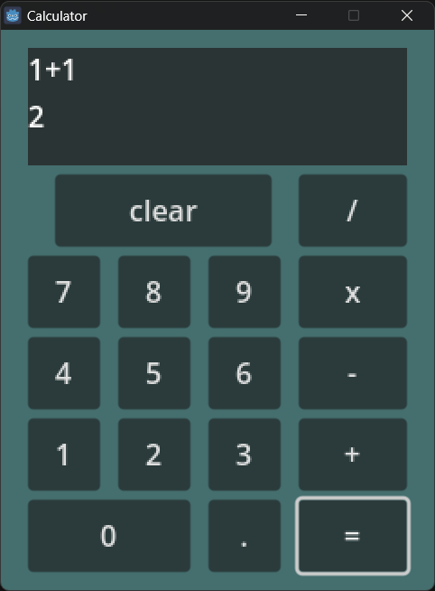

# Godot-Calculator
 A simple calculator made with Godot4. 
 
 This repository has both source code and files for the project as well as the exported runnable exe (Windows).

 

 # Functionality
- [x] Basic arithmetic (Addition, Subtraction, Multiplication, Division)
- [x] Display current calculation
- [x] Minimal error handling (Only on "=" being pressed)

